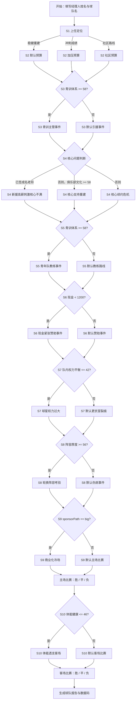

# 岚城联：剧情分支树

版本：0.3  
依据文件：`story-data.json`

这份文档只描述学生端可见剧情分支。当前游戏不是传统“从 A 跳到 B、从 B 跳到 C”的纯树状结构，而是：

```text
共同赛季阶段 + 条件触发事件 + 选项改变球队状态 + 下一阶段重新判断
```

也就是说，所有玩家都会依次经过 10 个阶段，但每个阶段遇到的具体事件会根据此前选择、现金、经营状态和竞技状态不同而变化。

## 分支总览



## 完整阶段树

### S1 上任定位

```text
S1 上任定位
└─ opening_board｜董事会会议：岚城联到底要成为什么球队？（默认）
   ├─ opening_stable｜稳健重建，先建立俱乐部原则
   │  └─ 设置 openingPath = stable；进入 S2 时通常走默认预算
   ├─ opening_ambition｜明确冲击成绩，优先让球队变强
   │  └─ 当前现金 +800；设置 openingPath = ambition；进入 S2 加压预算
   └─ opening_community｜回到本地社区，重建球迷连接
      └─ 当前现金 -150；设置 openingPath = community；进入 S2 社区预算
```

### S2 赛季预算

```text
S2 赛季预算
├─ budget_ambition｜加压预算会：董事会要看到成绩
│  触发：openingPath == ambition
│  ├─ budget_first_team_push｜重压之下继续加码一线队
│  │  └─ 门槛：现金 >= 1400；当前现金 -1400
│  └─ budget_balance_under_pressure｜保留一部分预算，做平衡投入
│     └─ 门槛：现金 >= 900；当前现金 -900
├─ budget_community｜社区预算会：球迷代表也坐进了房间
│  触发：openingPath == community
│  ├─ budget_youth_community｜青训与社区联合投入
│  │  └─ 门槛：现金 >= 850；当前现金 -850；第 8 阶段前设施尾款 250
│  └─ budget_respect_fans_buy_player｜买一名本地出身球员回归
│     └─ 门槛：现金 >= 1000；当前现金 -1000；工资承诺 +220
└─ budget_default｜赛季预算分配（默认）
   ├─ budget_first_team｜优先补强一线队
   │  └─ 门槛：现金 >= 1200；当前现金 -1200
   ├─ budget_youth｜优先青训和训练基地
   │  └─ 门槛：现金 >= 900；当前现金 -900；第 8 阶段前设施尾款 300
   └─ budget_balanced｜平衡投入
      └─ 门槛：现金 >= 1000；当前现金 -1000
```

### S3 球员来源

```text
S3 球员来源
├─ recruit_youth_path｜青训主管敲门：梯队里有个孩子可以试试
│  触发：青训体系 >= 58
│  ├─ recruit_promote_youth｜提拔青训前锋
│  │  └─ 门槛：现金 >= 80；当前现金 -80；设置 promotedYouth = true
│  └─ recruit_young_player｜买入年轻潜力球员
│     └─ 门槛：现金 >= 650；当前现金 -650；工资承诺 +180
└─ recruit_default｜青训新人与即战力引援（默认）
   ├─ recruit_veteran｜签下成名老将前锋
   │  └─ 门槛：现金 >= 1100；当前现金 -1100；工资承诺 +500；设置 signedVeteran = true
   ├─ recruit_young_default｜买入年轻潜力球员
   │  └─ 门槛：现金 >= 650；当前现金 -650；工资承诺 +180
   └─ recruit_loan｜租借体系型球员
      └─ 门槛：现金 >= 350；当前现金 -350
```

### S4 核心问题

```text
S4 核心问题
├─ star_new_veteran｜新援高薪刺激核心不满
│  触发：signedVeteran == true
│  优先级：最高；只要签过成名老将，优先进入这个分支
│  ├─ star_match_wage｜匹配顶薪，安抚核心
│  │  └─ 门槛：现金 >= 500；当前现金 -500；工资承诺 +800；奖金承诺 +300
│  └─ star_refuse_after_veteran｜拒绝涨薪，强调合同纪律
│     └─ 无立即支出
├─ star_support_rebuild｜核心愿意支持重建，但要看到长期计划
│  触发：俱乐部文化 >= 58
│  ├─ star_rebuild_captain｜让他成为重建队长，奖金与长期目标绑定
│  │  └─ 门槛：现金 >= 150；当前现金 -150；奖金承诺 +350
│  └─ star_sell_for_future｜坦诚告知重建计划，允许他离队争冠
│     └─ 当前现金 +1600；工资承诺 -450；设置 coreStarInTeam = false
└─ star_default｜核心球星续约危机（默认）
   ├─ star_full_contract｜满足全部要求
   │  └─ 门槛：现金 >= 500；当前现金 -500；工资承诺 +700；奖金承诺 +300
   ├─ star_wage_discipline｜拒绝涨薪，坚持工资结构
   │  └─ 无立即支出
   ├─ star_delay_talks｜承诺赛季后重谈
   │  └─ 门槛：现金 >= 150；当前现金 -150；设置 delayedStarTalks = true
   └─ star_sell｜主动出售核心，开启时代更替
      └─ 当前现金 +1600；工资承诺 -450；设置 coreStarInTeam = false
```

### S5 教练路线

```text
S5 教练路线
├─ coach_youth｜青年队教练得到更衣室支持
│  触发：青训体系 >= 58
│  ├─ coach_promote_youth｜提拔青年队教练
│  │  └─ 门槛：现金 >= 150；当前现金 -150；设置 headCoach = youth
│  └─ coach_current_with_youth_staff｜保留现任教练，让青年队教练进一线队教练组
│     └─ 门槛：现金 >= 300；当前现金 -300；设置 headCoach = current
└─ coach_default｜主教练与战术路线（默认）
   ├─ coach_star｜聘请名帅，立刻改造打法
   │  └─ 门槛：现金 >= 900；当前现金 -900；工资承诺 +300；设置 headCoach = star
   ├─ coach_support_current｜保留现任教练，强化教练组
   │  └─ 门槛：现金 >= 450；当前现金 -450；设置 headCoach = current
   └─ coach_promote_default｜提拔青年队教练
      └─ 门槛：现金 >= 150；当前现金 -150；设置 headCoach = youth
```

### S6 赞助与社区

```text
S6 赞助与社区
├─ sponsor_cash_tight｜现金紧张：赞助商知道你需要钱
│  触发：现金 < 1200
│  ├─ sponsor_forced_big｜接受高条件商业赞助
│  │  └─ 当前现金 +1500；设置 sponsorPath = big
│  └─ sponsor_hold_tight｜拒绝苛刻条件，继续压缩开支
│     └─ 无立即收入
└─ sponsor_default｜赞助商与社区关系（默认）
   ├─ sponsor_big｜接受大型商业赞助
   │  └─ 当前现金 +1400；设置 sponsorPath = big
   ├─ sponsor_local｜选择本地联合赞助
   │  └─ 当前现金 +650；青训专项资金 +200；设置 sponsorPath = local
   └─ sponsor_wait｜暂不签主赞助，等成绩出来再谈
      └─ 无立即收入；设置 sponsorPath = wait
```

### S7 更衣室

```text
S7 更衣室
├─ locker_star_power｜球星权力过大：替补开始抱怨
│  触发：队内权力平衡 <= 42
│  ├─ locker_back_coach｜公开支持主教练，树立纪律
│  │  └─ 无立即支出
│  ├─ locker_captains_meeting｜组织队长会议，内部调解
│  │  └─ 门槛：现金 >= 80；当前现金 -80
│  └─ locker_protect_stars｜安抚球星，牺牲替补球员
│     └─ 无立即支出
└─ locker_default｜更衣室裂痕（默认）
   ├─ locker_back_coach_default｜公开支持主教练，树立纪律
   │  └─ 无立即支出
   └─ locker_internal_default｜组织队长会议，内部调解
      └─ 门槛：现金 >= 80；当前现金 -80
```

### S8 伤病与医疗

```text
S8 伤病与医疗
├─ injury_depth_test｜轮换阵容经受考验
│  触发：阵容厚度 >= 56
│  ├─ injury_rotate_confident｜主动轮换，保护主力
│  │  └─ 门槛：现金 >= 120；当前现金 -120
│  └─ injury_keep_main_depth｜让主力继续磨合
│     └─ 无立即支出
└─ injury_default｜伤病与医疗投入（默认）
   ├─ injury_medical｜投入医疗与恢复团队
   │  └─ 门槛：现金 >= 550；当前现金 -550
   ├─ injury_rotate｜轮换主力，放弃热身赛成绩
   │  └─ 门槛：现金 >= 180；当前现金 -180
   └─ injury_push｜让主力坚持比赛，争取磨合
      └─ 无立即支出；设置 injuryRisk = true
```

### S9 第一场主场

```text
S9 第一场主场
├─ home_commercial_cold｜商业化冷场：主场不再像从前
│  触发：sponsorPath == big
│  ├─ home_fan_repair｜追加球迷动员与公益票
│  │  └─ 门槛：现金 >= 260；当前现金 -260；进入主场比赛模拟
│  └─ home_commercial_continue｜继续商业活动，保证收入
│     └─ 当前现金 +260；进入主场比赛模拟
└─ home_default｜第一场主场比赛（默认）
   ├─ home_fan_day｜球迷动员日
   │  └─ 门槛：现金 >= 220；当前现金 -220；进入主场比赛模拟
   ├─ home_business｜商业包厢与赞助商活动
   │  └─ 当前现金 +260；进入主场比赛模拟
   └─ home_normal｜正常办赛
      └─ 无额外收支；进入主场比赛模拟

主场比赛模拟结果：
├─ 胜：设置 homeResult = 胜；球迷信任、管理层耐心、媒体关系、心理稳定性、更衣室凝聚力上升
├─ 平：设置 homeResult = 平；管理层耐心小降，心理稳定性小升
└─ 负：设置 homeResult = 负；球迷信任、管理层耐心、媒体关系、心理稳定性、更衣室凝聚力下降
```

### S10 第一场客场

```text
S10 第一场客场
├─ away_fatigue｜体能透支：客场前夜的艰难选择
│  触发：体能健康 <= 46
│  ├─ away_rotate_tired｜大轮换，保护主力
│  │  └─ 无立即支出；进入客场比赛模拟
│  └─ away_push_tired｜延续首发，追求连贯性
│     └─ 无立即支出；设置 injuryRisk = true；进入客场比赛模拟
└─ away_default｜第一场客场比赛（默认）
   ├─ away_premium｜高规格客场后勤
   │  └─ 门槛：现金 >= 260；当前现金 -260；进入客场比赛模拟
   ├─ away_save｜节省差旅，正常出行
   │  └─ 门槛：现金 >= 80；当前现金 -80；进入客场比赛模拟
   ├─ away_rotate｜大轮换，保护主力
   │  └─ 无立即支出；进入客场比赛模拟
   └─ away_push｜延续主场首发，追求连胜
      └─ 无立即支出；设置 injuryRisk = true；进入客场比赛模拟

客场比赛模拟结果：
├─ 胜：设置 awayResult = 胜；球迷信任、管理层耐心、媒体关系、心理稳定性、更衣室凝聚力上升
├─ 平：设置 awayResult = 平；管理层耐心小降，心理稳定性小升
└─ 负：设置 awayResult = 负；球迷信任、管理层耐心、媒体关系、心理稳定性、更衣室凝聚力下降
```

## 关键交叉分支说明

### 1. S2 由 S1 直接决定

```text
S1 选“明确冲击成绩” → S2 加压预算
S1 选“回到本地社区” → S2 社区预算
S1 选“稳健重建” → S2 默认预算
```

### 2. S4 的优先级会覆盖文化路线

```text
如果 S3 签下成名老将：
  S4 必定优先进入“新援高薪刺激核心不满”
否则，如果俱乐部文化 >= 58：
  S4 进入“核心愿意支持重建”
否则：
  S4 进入默认“核心球星续约危机”
```

### 3. S6 的现金紧张分支会覆盖普通赞助

```text
进入 S6 时如果现金 < 1200：
  进入“现金紧张：赞助商知道你需要钱”
否则：
  进入普通赞助选择
```

### 4. S9 由赞助路线决定

```text
如果 S6 选择大型商业赞助：
  S9 进入“商业化冷场”
否则：
  S9 进入默认主场比赛
```

### 5. S10 受前面体能管理和主场后果影响

```text
进入 S10 时如果体能健康 <= 46：
  进入“体能透支”
否则：
  进入默认客场比赛
```

## 路线数量

按当前代码枚举：

```text
只计算玩家选择形成的完整路线：17,997 条
如果把主场和客场胜 / 平 / 负也算入结局：161,973 条
```

这些数量来自条件事件、现金门槛、状态变化和两场比赛随机结果共同组合，不是把每个阶段的选项数简单相乘。
